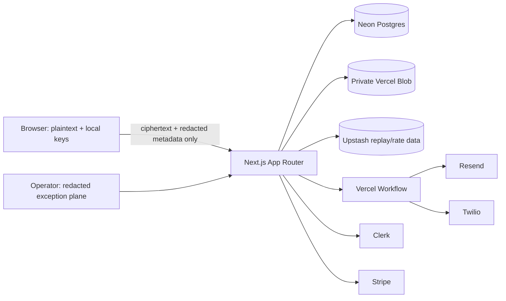
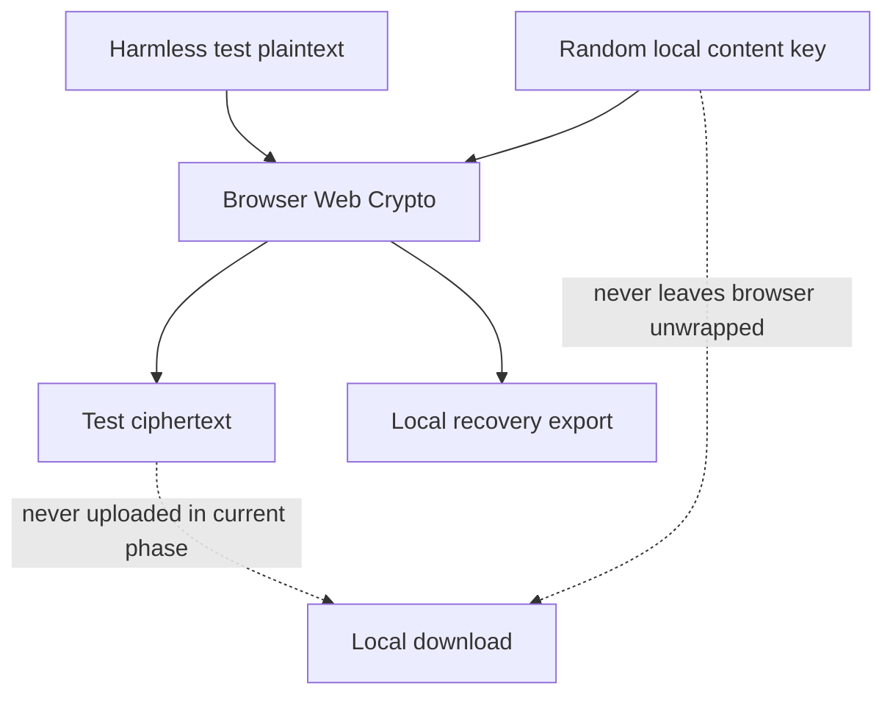
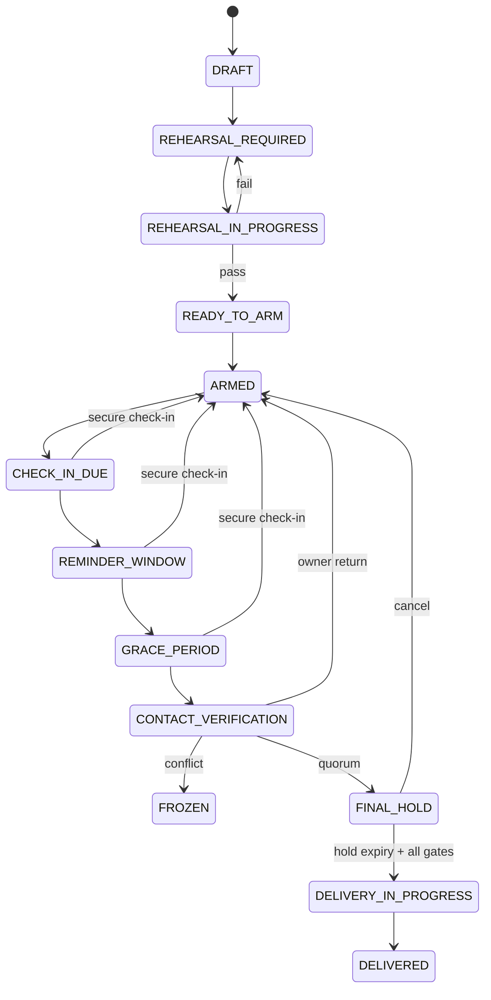
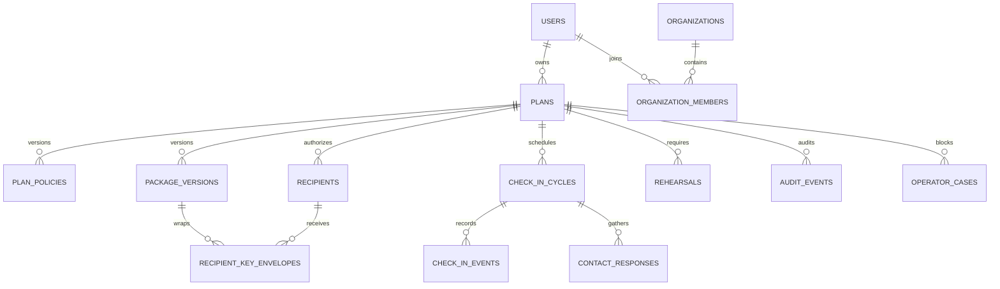

# Architecture

## System boundary

The browser alone prepares/decrypts packages. The application does not receive protected plaintext or unwrapped keys. Test mode currently exports ciphertext locally and has no real upload path.

## Request and data flows

1. Authenticated owner obtains a one-time scoped action challenge.
2. Browser validates inputs and, for harmless test packages, encrypts locally through the CryptoProvider.
3. Server accepts only versioned metadata/ciphertext in a future reviewed phase; ownership and policy are checked before storage.
4. Workflow reads an immutable policy version, records an attributable event, and asks the pure state reducer for the only permitted next state.
5. Provider calls are retryable step functions with deterministic idempotency keys.
6. Immediately before delivery, state, policy, package integrity, and global freeze are re-read. Any mismatch freezes.

## Cryptographic boundary

The provisional format is versioned and rejected when unknown. It is not approved for real data.

## State model

Security incident can freeze any pre-delivery state. Material changes require rehearsal; owner pause enters PAUSED. Unknown transitions reject without mutation.

## Database relationships

## Integration availability

Each adapter validates its own environment on invocation. Missing configuration returns a typed unavailable error. Rendering and builds never make provider calls.
