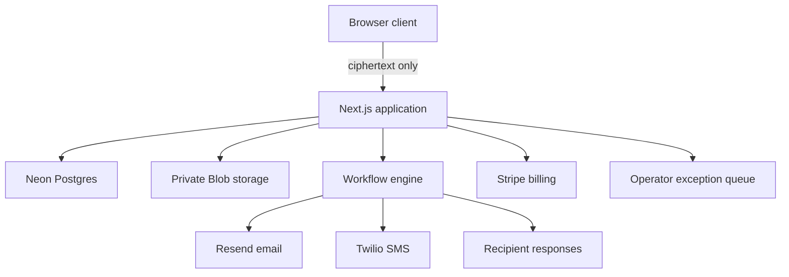
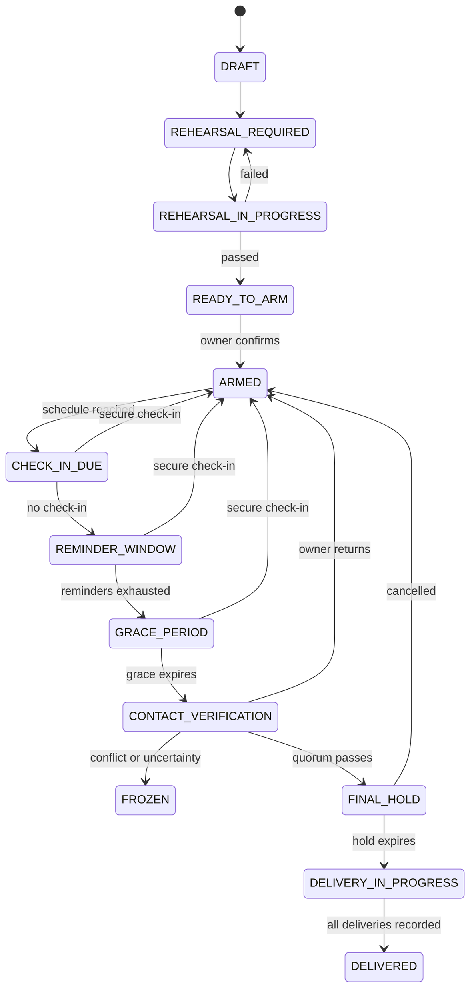

# Continuity Vault

> Self-custodial continuity infrastructure for people, households, founders, and organizations.

## Status

This repository specification defines a production-oriented rebuild of the Continuity Vault product concept.

The existing ChatGPT Sites version is a hosted product preview. It is not the source-of-truth repository for the Vercel implementation described here. The new Git repository created from this document must become the canonical source of truth for code, database migrations, tests, security documentation, and deployments.

This specification is intentionally strict:

- No server-side access to protected plaintext.
- No server-controlled recovery keys.
- SMS and email are notification channels, not sufficient authentication.
- No AI model may authorize, accelerate, or prevent a release.
- Any uncertainty, outage, conflicting evidence, or security incident freezes release processing.
- Real protected material must not be accepted until the cryptographic design and implementation receive independent review.

---

## 1. Codex quick start

Create a new Git repository and place this file at its root as `README.md`. Then give Codex this prompt:

```text
Build the Continuity Vault application described in README.md.

Treat README.md as the binding product and engineering specification. Start by reading it completely, then create:

1. PLAN.md with ordered implementation phases, dependencies, risks, and acceptance gates.
2. THREAT_MODEL.md with assets, trust boundaries, adversaries, misuse cases, mitigations, and residual risks.
3. ARCHITECTURE.md with diagrams, data flows, cryptographic boundaries, workflow states, and external integrations.
4. AGENTS.md with repository rules that require small commits, tests, schema migrations, zero secret leakage, fail-closed release behavior, and documentation updates.
5. A production-quality Next.js application using the specified stack.

Before writing the release engine, implement the deterministic state machine and its model-based tests. Before implementing real encrypted payload uploads, build only a clearly labeled test-package mode. Do not claim production cryptographic safety. Do not invent unspecified behavior: record questions or assumptions in DECISIONS.md.

Use a clean, restrained, institutional interface matching the design system in this README. Build responsive desktop and mobile experiences. Keep normal user flows simple and put technical details behind progressive disclosure.

Work in phases. At the end of each phase:
- run lint, typecheck, unit tests, integration tests, and the production build;
- update PLAN.md and DECISIONS.md;
- summarize changed files, test evidence, remaining risks, and the next phase;
- commit a coherent checkpoint.

Never place API keys, tokens, protected plaintext, recovery keys, or customer data in source control, logs, fixtures, screenshots, analytics, or error reports.
```

### Recommended repository creation flow

```bash
mkdir continuity-vault
cd continuity-vault
git init
# Save this file as README.md
codex
```

In Codex CLI, the directory where Codex starts is the project. In the IDE extension, the open folder or workspace is the project. A ChatGPT Site does not automatically become a local Codex project.

---

## 2. Product definition

Continuity Vault lets a customer:

1. Prepare an encrypted continuity package locally on their own device.
2. Choose trusted recipients and an authorization policy.
3. Choose a recurring secure check-in schedule.
4. Rehearse the process with harmless test material.
5. Arm the plan.
6. Receive automated check-in reminders.
7. Trigger a staged, fail-closed verification process if check-ins are missed.
8. Deliver ciphertext to authorized recipients only after every deterministic policy condition passes.
9. Export the complete encrypted package and policy at any time.

### The customer is paying for

- Reliable monitoring.
- Durable scheduling.
- Multi-channel reminders.
- Recipient readiness checks.
- Release rehearsals.
- Deterministic policy execution.
- Redundant delivery routes.
- Tamper-evident receipts.
- Encrypted portability.
- Continuous security maintenance.

The customer is **not** paying the company to possess keys, read protected material, act as an executor, make subjective judgments about the customer, or guarantee that a third-party channel will always function.

### Positioning

Use the phrase **continuity system** or **continuity protocol** in public product copy. Avoid alarming terminology in primary navigation and onboarding.

Primary promise:

> We monitor the signal and coordinate delivery. We cannot read your package or recover a key you chose to hold yourself.

---

## 3. Initial product scope

### Supported in version 1

- Personal continuity instructions.
- Household continuity instructions.
- Founder and small-business continuity plans.
- Encrypted document and instruction packages.
- One owner per personal plan.
- Multiple organization administrators for founder plans.
- Email, SMS, and in-app notifications.
- Secure web check-ins.
- Trusted-contact verification.
- Configurable grace periods.
- Configurable quorum policies.
- Test-only release rehearsals.
- Encrypted exports.
- Subscription billing.
- Operator exception queue.

### Explicitly excluded from version 1

- Automatic movement of money, cryptocurrency, securities, or other assets.
- Automatic execution of legal documents.
- Public disclosures or public posting.
- Medical or emergency-response services.
- Location tracking.
- Continuous device surveillance.
- Secret-word SMS authentication.
- Server-side recovery-key escrow.
- AI-generated release decisions.
- Anonymous plans.
- Plans containing unlawful, threatening, or abusive instructions.
- A promise that the service replaces an attorney, executor, trustee, insurer, or emergency contact.

These exclusions are product safety controls, not merely postponed features.

---

## 4. Layman explanation

The service works like a very careful alarm clock with several safety locks.

- The customer stores a locked box with the service.
- The service cannot open the box.
- The customer checks in periodically through a secure account.
- A text message only tells the customer that a check-in is due.
- If the customer does not check in, the system sends more reminders and waits.
- After a grace period, trusted contacts are asked to respond securely.
- Conflicting answers stop the process.
- A final cancellation window occurs before delivery.
- If every rule passes, recipients receive the locked box.
- Recipients use recovery material arranged separately by the customer.

The normal process is automated. Human operators see only unusual problems such as bounced messages, conflicting responses, suspected account changes, or provider failures.

---

## 5. Product principles and invariants

These requirements are non-negotiable and must be represented as tests.

### Security invariants

1. The server never receives protected plaintext.
2. The server never receives an unwrapped content-encryption key.
3. Logs never contain protected content, recovery material, full access tokens, authentication secrets, or decrypted attachments.
4. A static SMS reply never counts as a secure check-in.
5. A single failed notification never advances the release state.
6. A subscription or payment failure never triggers release.
7. A platform outage never triggers release.
8. A security incident freezes release processing.
9. A phone-number change requires step-up authentication, notices to existing channels, and a cooling-off period.
10. Recipient, policy, or key changes require re-rehearsal before arming.
11. Every state transition is attributable, idempotent, versioned, and auditable.
12. A release can advance only from explicitly permitted predecessor states.
13. No administrator can decrypt a package.
14. No administrator can unilaterally force a release.
15. All external callbacks and webhooks require signature verification and replay protection.

### Product invariants

1. The customer can export their encrypted package and policy at any time.
2. Cancelling the subscription does not destroy the only copy of customer material.
3. Recipients do not need a paid subscription to receive test or authorized deliveries.
4. Every plan must pass a rehearsal before it can be armed.
5. Every plan displays its next check-in, current status, last rehearsal, and recipient readiness.
6. Every dangerous action shows its effect before confirmation.
7. Any ambiguous state is displayed as blocked, not healthy.

---

## 6. Recommended technical stack

Use current compatible releases and commit the lockfile.

| Layer                 | Choice                                     | Purpose                                                        |
| --------------------- | ------------------------------------------ | -------------------------------------------------------------- |
| Application           | Next.js App Router, React, TypeScript      | Full-stack web application                                     |
| Styling               | Tailwind CSS and shadcn/ui primitives      | Accessible, consistent interface                               |
| Validation            | Zod                                        | Runtime schema validation                                      |
| Database              | Neon Postgres through Vercel Marketplace   | Relational policy, billing, and event data                     |
| ORM                   | Drizzle ORM and Drizzle Kit                | Typed queries and migrations                                   |
| Durable orchestration | Vercel Workflow DevKit                     | Check-in, wait, retry, pause, resume, and escalation workflows |
| Authentication        | Clerk through Vercel Marketplace           | Account authentication and managed session security            |
| Object storage        | Private Vercel Blob                        | Ciphertext packages and encrypted exports only                 |
| Rate limiting         | Upstash Redis                              | Rate limits, replay guards, and short-lived locks              |
| Email                 | Resend and React Email                     | Transactional messages and delivery webhooks                   |
| SMS                   | Twilio Messaging or Verify                 | Notification channel; never sole proof of identity             |
| Payments              | Stripe Checkout and Billing Portal         | Annual and monthly subscriptions                               |
| Testing               | Vitest, Workflow Vitest plugin, Playwright | Unit, workflow, and end-to-end coverage                        |
| Error monitoring      | Sentry or equivalent                       | Redacted errors and release alerts                             |
| Analytics             | Privacy-minimized product analytics        | Funnel and reliability metrics only                            |
| Deployment            | Vercel with Git integration                | Preview deployments and production promotion                   |

### Important storage rules

- Store relational data in Neon Postgres.
- Store ciphertext packages in private Vercel Blob.
- Store rate-limit counters and short-lived replay guards in Upstash Redis.
- Do not use deprecated `@vercel/postgres` or `@vercel/kv` packages.
- Use lazy database initialization so builds do not fail before environment provisioning.

---

## 7. High-level architecture



### Trust boundaries

#### Browser trust boundary

The browser performs:

- Package encryption.
- Recovery-kit generation.
- Content key wrapping for recipients or offline recovery material.
- Local decryption.
- Plaintext rendering.

#### Application trust boundary

The server performs:

- Authentication and authorization.
- Policy storage and validation.
- Workflow scheduling.
- Ciphertext storage and retrieval authorization.
- Notification orchestration.
- Recipient status collection.
- Billing.
- Event receipts.
- Exception management.

The application must behave correctly even though it cannot inspect protected contents.

#### External-provider trust boundary

Email and SMS providers receive only the minimum delivery information needed. Notification content must not reveal:

- Package titles.
- Package contents.
- Sensitive recipient roles.
- Why the plan exists.
- Recovery information.

---

## 8. Cryptographic design requirements

This section defines the boundary and intended properties. It is not permission to invent a custom cryptographic protocol.

### Required properties

- Authenticated encryption for every package and attachment.
- A fresh random content-encryption key for every package version.
- A fresh nonce/IV for every encryption operation.
- Separation between ciphertext, wrapped keys, and recovery material.
- Cryptographic hashes for integrity receipts.
- Explicit algorithm and format versioning.
- Forward-compatible package manifests.
- No plaintext or unwrapped keys in application telemetry.
- Secure browser memory handling where practical.
- Independent cryptographic review before real-data launch.

### Provisional browser package format

```json
{
  "format": "continuity-vault-package",
  "version": 1,
  "packageId": "uuid",
  "createdAt": "ISO-8601",
  "algorithmSuite": "PROVISIONAL-REVIEW-REQUIRED",
  "ciphertextBlobId": "opaque-id",
  "ciphertextSha256": "hex",
  "manifestCiphertext": "base64url",
  "recipientEnvelopes": [
    {
      "recipientKeyId": "opaque-id",
      "wrappedContentKey": "base64url"
    }
  ],
  "aad": {
    "planId": "uuid",
    "policyVersion": 1,
    "packageVersion": 1
  }
}
```

### Implementation rule

Use an established, reviewed library or standards-based browser cryptography. Create a `CryptoProvider` interface so algorithms and package formats can be reviewed and migrated without rewriting business logic.

Required interface:

```ts
interface CryptoProvider {
  createPackage(input: LocalPackageInput): Promise<EncryptedPackage>;
  createRecipientEnvelope(input: RecipientEnvelopeInput): Promise<KeyEnvelope>;
  verifyPackage(input: EncryptedPackage): Promise<IntegrityResult>;
  decryptPackage(input: DecryptPackageInput): Promise<LocalPackageOutput>;
  exportRecoveryKit(input: RecoveryKitInput): Promise<EncryptedRecoveryKit>;
}
```

Do not build production key escrow. Do not silently downgrade algorithms. Reject unknown package versions safely.

---

## 9. Authentication model

### Customer authentication

- Use managed authentication through Clerk.
- Prefer passkeys/WebAuthn or other phishing-resistant authentication when supported by the selected provider and account.
- Require step-up authentication for arming, recipient changes, key changes, policy changes, exports, and cancellation.
- Provide recovery codes or provider-supported recovery flows without giving the application access to package recovery keys.
- Record authentication method class and event result, never the authentication secret.

### SMS and email

SMS and email are notification channels.

A notification can contain a short-lived, single-use link, but the link must lead to an authenticated application flow. A reply such as `YES`, `SAFE`, or another secret word does not complete a check-in.

### Recipient authentication

Recipients create or verify a free recipient account. A recipient response requires:

- An authenticated session.
- A plan-specific, short-lived challenge.
- Clear display of what the response means.
- Idempotency and replay protection.
- A signed audit event.

### Account-change cooling periods

| Change                    | Minimum behavior                                        |
| ------------------------- | ------------------------------------------------------- |
| Phone number              | Step-up auth, notify old channels, cooling period       |
| Primary email             | Step-up auth, notify old and new emails, cooling period |
| Add/remove recipient      | Step-up auth, notify owner, require rehearsal           |
| Change quorum             | Step-up auth, explain effect, require rehearsal         |
| Replace recovery material | Step-up auth, cooling period, require rehearsal         |
| Arm or re-arm             | Step-up auth and passed rehearsal                       |

---

## 10. Deterministic workflow state machine

The workflow engine, not an LLM, controls state.

### Plan states

```ts
type PlanState =
  | "DRAFT"
  | "REHEARSAL_REQUIRED"
  | "REHEARSAL_IN_PROGRESS"
  | "READY_TO_ARM"
  | "ARMED"
  | "CHECK_IN_DUE"
  | "REMINDER_WINDOW"
  | "GRACE_PERIOD"
  | "CONTACT_VERIFICATION"
  | "FINAL_HOLD"
  | "DELIVERY_IN_PROGRESS"
  | "DELIVERED"
  | "PAUSED"
  | "FROZEN"
  | "CANCELLED";
```

### Allowed transition outline



At any pre-delivery state:

- A security incident transitions the plan to `FROZEN`.
- A material policy or key change transitions the plan to `REHEARSAL_REQUIRED`.
- An owner pause transitions the plan to `PAUSED`.
- A payment problem affects account features but must not advance release.

### Default timeline

The customer may configure policy within safe system limits.

| Relative time | Default action                        |
| ------------- | ------------------------------------- |
| Due date      | In-app and email check-in request     |
| +2 days       | Email reminder and SMS notification   |
| +5 days       | Second SMS and backup email           |
| +8 days       | Grace-period warning                  |
| +14 days      | Trusted contacts notified             |
| +21 days      | Contact-verification window may begin |
| +28 days      | Final hold begins if quorum passes    |
| +30 days      | Ciphertext delivery may begin         |

Do not hard-code this timeline inside UI components. Store a versioned policy object validated against server-side limits.

### Workflow implementation requirements

- Use Vercel Workflow DevKit for durable sleeps, retries, hooks, and resumptions.
- Keep the workflow function limited to orchestration.
- Put provider calls and database changes in retryable step functions.
- Use idempotency keys for every notification and delivery attempt.
- Mark permanent validation failures as fatal.
- Mark transient provider failures as retryable.
- Persist workflow run IDs against plan-cycle records.
- Test sleeps and hooks with the Workflow Vitest plugin.
- Never call an external provider directly from rendering code.

---

## 11. Database model

Use UUIDs, UTC timestamps, foreign keys, uniqueness constraints, explicit status enums, and soft deletion where required for audit preservation.

### Core tables

#### `users`

- `id`
- `auth_provider_user_id` unique
- `primary_email_hash`
- `locale`
- `timezone`
- `status`
- `created_at`
- `updated_at`

Do not duplicate unnecessary identity-provider profile data.

#### `organizations`

- `id`
- `name`
- `type`
- `status`
- `created_at`
- `updated_at`

#### `organization_members`

- `organization_id`
- `user_id`
- `role`
- `status`
- `created_at`

#### `plans`

- `id`
- `owner_user_id`
- `organization_id` nullable
- `display_name`
- `purpose`
- `state`
- `timezone`
- `active_policy_version_id`
- `active_package_version_id`
- `next_check_in_at`
- `armed_at`
- `paused_at`
- `frozen_at`
- `created_at`
- `updated_at`

#### `plan_policies`

- `id`
- `plan_id`
- `version`
- `check_in_interval_days`
- `reminder_schedule_json`
- `grace_period_days`
- `contact_verification_days`
- `final_hold_hours`
- `quorum_required`
- `quorum_total`
- `policy_json`
- `policy_hash`
- `created_by_user_id`
- `created_at`
- unique `(plan_id, version)`

#### `package_versions`

- `id`
- `plan_id`
- `version`
- `format_version`
- `blob_url_or_key`
- `ciphertext_sha256`
- `encrypted_manifest`
- `algorithm_suite`
- `size_bytes`
- `created_by_user_id`
- `created_at`
- unique `(plan_id, version)`

Never store plaintext content, plaintext filenames, or unwrapped content keys.

#### `recipients`

- `id`
- `plan_id`
- `user_id` nullable until claimed
- `email_hash`
- `phone_hash` nullable
- `display_label`
- `role`…3001 tokens truncated…view data.
- Database migrations reviewed before production promotion.
- Rollback instructions.
- Incident-response runbooks.
- Quarterly disaster-recovery exercise.
- A second notification provider documented as a migration/fallback option.

### Global freeze

Use an independently readable configuration flag, such as Edge Config, for a global release freeze. The release workflow must check the freeze immediately before any irreversible delivery step.

---

## 20. Notifications

### Email templates

- Welcome and account verification.
- Recipient invitation.
- Check-in due.
- Check-in reminder.
- Grace period started.
- Recipient response requested.
- Final hold started.
- Rehearsal requested.
- Rehearsal result.
- Account detail changed.
- Policy changed.
- Package version changed.
- Billing receipt.
- Payment problem.
- Delivery completed.

### SMS templates

SMS copy must be short and neutral. Example:

> Continuity Vault: a secure check-in is due. Open the app to respond. This message cannot complete the check-in.

Do not include plan purpose, package name, recipient details, or recovery information.

### Delivery tracking

- Verify provider webhook signatures.
- Store status codes, not full message bodies.
- Use deterministic idempotency keys.
- Handle delivered, bounced, complained, suppressed, and failed events.
- Do not endlessly retry permanent failures.
- Open an operator case when the last viable route fails.

---

## 21. Billing and pricing

Use Stripe subscriptions with annual billing emphasized.

### Proposed plans

| Plan               |     Annual price | Monthly option | Scope                                               |
| ------------------ | ---------------: | -------------: | --------------------------------------------------- |
| Test Mode          | Free for 30 days |            N/A | Test packages and rehearsals only                   |
| Personal           |          CAD 149 |         CAD 15 | One plan, three recipients                          |
| Household          |          CAD 299 |         CAD 30 | Multiple plans, ten recipients                      |
| Founder            |        CAD 1,200 |        CAD 120 | Team roles, organization plans, priority exceptions |
| Founder onboarding |     CAD 500 once |            N/A | Configuration and supervised rehearsal              |

Pricing is a product assumption that must be configurable through Stripe Price IDs rather than hard-coded.

### Billing requirements

- Stripe Checkout for subscriptions.
- Stripe Customer Portal for payment method, invoice, and cancellation management.
- Verify Stripe webhook signatures against the raw body.
- Make webhook processing idempotent.
- Store Stripe IDs, not payment-card data.
- A payment failure must never trigger release.
- Define what functionality remains available after cancellation.
- Allow encrypted export before account closure.
- Use annual pricing by default for stronger unit economics.

### Entitlements

Create a server-side entitlement layer. Do not scatter price-ID checks throughout components.

```ts
type Entitlements = {
  maxPlans: number;
  maxRecipientsPerPlan: number;
  rehearsalFrequency: "quarterly" | "monthly";
  organizationRoles: boolean;
  priorityExceptionHandling: boolean;
};
```

---

## 22. Design system

The visual direction should feel calm, exact, premium, and institutional. It should not resemble a generic crypto dashboard or an emergency alert interface.

### Brand personality

- Calm certainty.
- Clear boundaries.
- Quiet technical competence.
- Human-readable reliability.
- No sensational imagery.

### Color tokens

```css
:root {
  --cv-ink: #10201a;
  --cv-ink-soft: #32443c;
  --cv-forest: #173f32;
  --cv-forest-deep: #0d2a21;
  --cv-mint: #baf5d1;
  --cv-acid: #d7ff89;
  --cv-paper: #f4f3ed;
  --cv-paper-deep: #e8e7df;
  --cv-success: #2f7d57;
  --cv-warning: #9a6a25;
  --cv-danger: #a7473f;
  --cv-line: rgba(16, 32, 26, 0.14);
}
```

Danger colors are reserved for action-required, frozen, or destructive states. Armed and healthy states use forest and mint.

### Typography

- Primary: Geist Sans or an equivalent neutral grotesk.
- Technical metadata: Geist Mono.
- Large headings use restrained negative tracking.
- Body text prioritizes readability over density.
- Minimum body size: 16px in primary flows.

### Layout

- Maximum content width around 1200px.
- Eight-point spacing system.
- Strong vertical rhythm.
- Low-radius or medium-radius cards; avoid excessive floating pills.
- One primary action per screen.
- Progressive disclosure for technical details.
- Responsive navigation.
- Mobile-first check-in and recipient flows.

### Components

- `StatusBadge`
- `PlanHealthCard`
- `CheckInCountdown`
- `RecipientReadinessList`
- `PolicyTimeline`
- `RehearsalChecklist`
- `IntegrityReceipt`
- `EncryptedPackageCard`
- `SecurityBoundaryCallout`
- `StepUpConfirmationDialog`
- `OperatorCaseCard`
- `FreezeBanner`
- `EmptyState`
- `Skeleton`
- `ErrorState`

### Accessibility

- Meet WCAG 2.2 AA as a release target.
- Full keyboard navigation.
- Visible focus indicators.
- Semantic headings and landmarks.
- Accessible form labels and descriptions.
- No meaning communicated by color alone.
- Respect reduced-motion preferences.
- Minimum touch target approximately 44 by 44 pixels.
- Screen-reader announcements for state changes.
- Error summaries that link to invalid fields.
- Test 200% zoom and narrow mobile layouts.

---

## 23. Repository structure

```text
continuity-vault/
├── app/
│   ├── (marketing)/
│   ├── (auth)/
│   ├── app/
│   │   ├── onboarding/
│   │   ├── plans/
│   │   ├── billing/
│   │   └── settings/
│   ├── recipient/
│   ├── internal/
│   └── api/
│       ├── webhooks/
│       └── ...
├── components/
│   ├── ui/
│   ├── marketing/
│   ├── plans/
│   ├── recipients/
│   ├── rehearsals/
│   └── internal/
├── db/
│   ├── schema/
│   ├── migrations/
│   ├── queries/
│   └── index.ts
├── emails/
├── lib/
│   ├── auth/
│   ├── billing/
│   ├── crypto/
│   ├── notifications/
│   ├── policy/
│   ├── receipts/
│   ├── security/
│   ├── storage/
│   └── validation/
├── workflows/
│   ├── check-in-cycle.ts
│   ├── rehearsal.ts
│   └── delivery.ts
├── tests/
│   ├── unit/
│   ├── integration/
│   ├── workflow/
│   ├── e2e/
│   ├── fixtures/
│   └── security/
├── scripts/
├── public/
├── README.md
├── AGENTS.md
├── PLAN.md
├── ARCHITECTURE.md
├── THREAT_MODEL.md
├── DECISIONS.md
├── SECURITY.md
├── PRIVACY_MODEL.md
├── INCIDENT_RESPONSE.md
├── .env.example
├── drizzle.config.ts
├── next.config.ts
├── package.json
└── vercel.json
```

---

## 24. Environment variables

Commit `.env.example` with empty placeholders. Never commit `.env.local`.

```env
# Public application configuration
NEXT_PUBLIC_APP_URL=
NEXT_PUBLIC_CLERK_PUBLISHABLE_KEY=
NEXT_PUBLIC_STRIPE_PUBLISHABLE_KEY=

# Authentication
CLERK_SECRET_KEY=
CLERK_WEBHOOK_SECRET=

# Database
DATABASE_URL=

# Private object storage
BLOB_READ_WRITE_TOKEN=

# Rate limiting
UPSTASH_REDIS_REST_URL=
UPSTASH_REDIS_REST_TOKEN=

# Email
RESEND_API_KEY=
RESEND_WEBHOOK_SECRET=
EMAIL_FROM=

# SMS
TWILIO_ACCOUNT_SID=
TWILIO_AUTH_TOKEN=
TWILIO_MESSAGING_SERVICE_SID=
TWILIO_WEBHOOK_SECRET=

# Payments
STRIPE_SECRET_KEY=
STRIPE_WEBHOOK_SECRET=
STRIPE_PRICE_PERSONAL_ANNUAL=
STRIPE_PRICE_PERSONAL_MONTHLY=
STRIPE_PRICE_HOUSEHOLD_ANNUAL=
STRIPE_PRICE_HOUSEHOLD_MONTHLY=
STRIPE_PRICE_FOUNDER_ANNUAL=
STRIPE_PRICE_FOUNDER_MONTHLY=

# Operations
GLOBAL_RELEASE_FREEZE_DEFAULT=true
INTERNAL_OPERATOR_ROLE_ID=
SENTRY_DSN=
```

Only `NEXT_PUBLIC_` values may reach the browser, and they must never contain secrets.

---

## 25. Vercel setup

### Initial project

```bash
npm install
npm run typecheck
npm test
npm run build
vercel link
```

### Marketplace integrations

Provision through the Vercel Marketplace when available so environment variables are attached to the correct project.

```bash
vercel integration add clerk
vercel integration add neon
vercel integration add upstash
vercel integration add resend
vercel integration add stripe
```

Provision Vercel Blob through the project storage interface.

After provisioning or changing integrations:

```bash
vercel env pull .env.local --yes
```

### Environments

- Development uses separate test integrations and non-production data.
- Preview deployments use preview-scoped variables and isolated data where possible.
- Production uses production-only secrets.
- Preview must never use the production release workflow or real customer packages.
- Set `GLOBAL_RELEASE_FREEZE_DEFAULT=true` until production launch approval.

### Deployment strategy

1. Every feature branch creates a preview deployment.
2. Run lint, typecheck, unit tests, workflow tests, and build before merge.
3. Run database migrations as an explicit gated step.
4. Run end-to-end tests against the preview.
5. Promote the exact validated preview artifact to production.
6. Review production error logs after deployment.
7. Maintain documented rollback and freeze procedures.

---

## 26. Test strategy

### Unit tests

- Policy validation.
- Quorum calculation.
- Timeline calculation.
- Entitlement calculation.
- Idempotency-key generation.
- Receipt hash chaining.
- Authorization helpers.
- Redaction helpers.
- Package-manifest validation.
- State-transition guards.

### Model-based state-machine tests

Generate valid and invalid event sequences. Assert:

- Invalid predecessor transitions are rejected.
- Duplicate events are idempotent.
- Payment events cannot advance release.
- SMS replies cannot complete check-ins.
- Conflicting contact responses freeze the cycle.
- Provider failure cannot advance release.
- Global freeze blocks delivery.
- Package-integrity failure blocks delivery.
- Policy changes require rehearsal.
- Owner check-in safely cancels pre-delivery escalation.

### Workflow integration tests

Use the Vercel Workflow Vitest integration to test:

- Durable sleeps.
- Reminder scheduling.
- Hook waiting and resumption.
- Retryable provider errors.
- Fatal validation errors.
- Owner return during every stage.
- Quorum pass, fail, timeout, and conflict.
- Final hold.
- Delivery idempotency.
- Freeze activation immediately before delivery.

### API tests

- Authentication and authorization.
- Object ownership.
- Cross-tenant isolation.
- Input validation.
- Rate limiting.
- CSRF defenses.
- Webhook signature verification.
- Webhook replay rejection.
- Blob access controls.
- Audit-event creation.

### End-to-end tests

- New personal-plan onboarding.
- Recipient invitation and verification.
- Test package creation.
- Rehearsal pass.
- Arm plan.
- Secure check-in.
- Missed-check-in simulation in test mode.
- Owner return during grace period.
- Contact quorum simulation.
- Final hold cancellation.
- Encrypted export.
- Subscription checkout and portal in Stripe test mode.
- Operator exception handling.

### Accessibility tests

- Automated axe checks.
- Keyboard-only navigation.
- Screen-reader smoke testing.
- Focus management in dialogs.
- Error-message association.
- Color contrast.
- Reduced motion.
- 200% zoom.

### Security tests

- No plaintext in network requests after local encryption.
- No protected content in logs.
- No secrets in client bundles.
- No unauthorized Blob access.
- Replay and duplicate webhook handling.
- Rate-limit and brute-force resistance.
- Session fixation protections through the auth provider.
- Insecure direct-object reference tests.
- Tenant-isolation tests.
- Dependency and supply-chain scans.

---

## 27. Observability and metrics

### Reliability metrics

- Check-in workflow success rate.
- Reminder delivery rate by channel.
- Rehearsal pass rate.
- Recipient readiness rate.
- Workflow retry rate.
- Workflow age by state.
- Operator case volume.
- Mean time to resolve exceptions.
- False-escalation cancellation rate.
- Delivery completion rate.

### Product metrics

- Onboarding completion.
- Time to first armed plan.
- Time to first rehearsal.
- Recipient invitation acceptance.
- Trial-to-paid conversion.
- Annual renewal.
- Export and cancellation rates.

### Privacy rules

- Do not record protected-content names.
- Do not record message bodies.
- Do not record recovery materials.
- Do not send recipient identities to analytics.
- Use opaque IDs and coarse event categories.
- Document retention periods.

### Alerts

Create alerts for:

- Any attempted delivery while global freeze is active.
- Workflow/database state mismatch.
- Webhook signature failures above threshold.
- Provider outage.
- Unusual account-change volume.
- Retry exhaustion.
- Audit hash-chain failure.
- Unauthorized internal-route attempts.

---

## 28. Security documentation required before launch

- `THREAT_MODEL.md`
- `SECURITY.md`
- `PRIVACY_MODEL.md`
- `INCIDENT_RESPONSE.md`
- `KEY_MANAGEMENT.md`
- `CRYPTOGRAPHY.md`
- `DATA_RETENTION.md`
- `BACKUP_AND_RESTORE.md`
- `VENDOR_RISK.md`
- `OPERATOR_ACCESS.md`
- `RELEASE_SAFETY_CASE.md`

### Threats to cover

- Account takeover.
- SIM swap and phone-number porting.
- Email-account compromise.
- Stolen recipient link.
- Replay attacks.
- Malicious recipient.
- Malicious operator.
- Database compromise.
- Blob-storage exposure.
- Supply-chain compromise.
- Workflow duplication.
- Clock or scheduling error.
- Provider outage.
- Conflicting evidence.
- Subscription state error.
- Cross-tenant access.
- Accidental plaintext logging.
- Loss of recovery material.
- Coercive or abusive plan configuration.

---

## 29. Legal and policy requirements

Obtain qualified legal review for launch jurisdictions. The product must clearly state that it is not:

- An executor or trustee.
- A legal-document execution service.
- A custodian of recovery keys.
- An emergency service.
- A substitute for professional legal, financial, medical, or security advice.
- A guarantee that a third-party delivery route will succeed.

Required documents and processes:

- Terms of service.
- Privacy policy.
- Acceptable-use policy.
- Subprocessor list.
- Data-retention policy.
- Recipient-consent and messaging-consent flow.
- Abuse-reporting process.
- Law-enforcement request policy.
- Security-reporting address.
- Incident-notification process.
- Jurisdiction-specific messaging compliance.
- Age and contractual-capacity review appropriate to the launch market.

Do not accept real protected material during a public prototype or unaudited beta.

---

## 30. Development phases

### Phase 0 — Repository foundation

Deliverables:

- Next.js project.
- TypeScript strict mode.
- Formatting, linting, tests, commit hooks.
- CI workflow.
- Design tokens and component foundations.
- Documentation set.
- No external integrations yet.

Exit gate:

- Clean production build.
- Tests and checks run in CI.
- Threat model drafted.

### Phase 1 — Public product and test mode

Deliverables:

- Marketing site.
- Pricing page.
- Security-boundary page.
- Authentication.
- Plan designer.
- Test-package browser encryption.
- Test-only local export.
- Clear prototype warnings.

Exit gate:

- No real protected material accepted.
- No release workflow.
- Usability test completed.

### Phase 2 — Accounts, plans, recipients, and billing

Deliverables:

- Neon database and migrations.
- Plan and policy CRUD.
- Recipient invitations and accounts.
- Stripe test-mode subscriptions.
- Resend transactional email.
- Audit events.

Exit gate:

- Tenant isolation tested.
- Webhook signature and replay tests pass.
- Billing cannot affect release state.

### Phase 3 — Durable check-ins

Deliverables:

- Vercel Workflow state machine.
- Secure check-in challenges.
- Email and SMS notifications.
- Retry logic.
- Grace periods.
- Owner return and cancellation paths.
- Operator exception queue.

Exit gate:

- Model-based state tests pass.
- Workflow integration suite passes.
- Outage behavior confirmed fail-closed.

### Phase 4 — Release rehearsals

Deliverables:

- Test package delivery.
- Recipient readiness.
- Quorum simulation.
- Cancellation test.
- Recovery-guide test.
- Tamper-evident rehearsal receipt.

Exit gate:

- A plan cannot arm without passing rehearsal.
- Rehearsal cannot access or deliver a real package.

### Phase 5 — Cryptographic production candidate

Deliverables:

- Reviewed package format.
- Recipient key envelopes.
- Private ciphertext storage.
- Recovery kit.
- Crypto migration/versioning support.
- Security and privacy review.

Exit gate:

- Independent cryptographic review completed.
- Independent penetration test completed.
- Critical findings resolved and retested.

### Phase 6 — Limited production pilot

Deliverables:

- Capped user cohort.
- Incident response.
- Status page.
- Backup restoration test.
- Provider fallback runbook.
- Support workflow.
- Production billing.

Exit gate:

- Operational review approves expansion.
- No unresolved critical or high-severity security findings.

---

## 31. Definition of done

A feature is not done until:

- Acceptance criteria are documented.
- Types and runtime validation agree.
- Authorization is enforced server-side.
- Audit events are emitted.
- Idempotency is addressed.
- Failure behavior is specified.
- Unit and integration tests exist.
- Accessibility is checked.
- Logs are redacted.
- Documentation is updated.
- Production build succeeds.

The application is not production-ready until:

- The state-machine test suite passes.
- Workflow integration tests pass.
- Tenant isolation is verified.
- Restore testing succeeds.
- Global freeze is exercised.
- External-provider failure simulations pass.
- Independent security review is complete.
- Independent cryptographic review is complete.
- Legal and policy review is complete.
- Incident-response roles are assigned.
- The production environment is separated from preview and test data.

---

## 32. Required launch copy

Display these ideas prominently in plain language:

- “Your package is encrypted on your device.”
- “We do not hold the key required to read it.”
- “Texts and emails are reminders; secure responses happen in the app.”
- “A missed reminder does not immediately deliver anything.”
- “Conflicting or uncertain information stops delivery.”
- “Test the complete process before relying on it.”
- “Export your encrypted plan at any time.”
- “This service does not replace an executor, attorney, trustee, or emergency service.”

Avoid:

- “Guaranteed.”
- “Impossible to hack.”
- “Unbreakable.”
- “Zero risk.”
- “We will know what happened.”
- Any claim that has not been demonstrated by testing and independent review.

---

## 33. Final engineering instruction

Build the smallest trustworthy version first.

The sequence is:

1. Deterministic policy model.
2. Test-only user experience.
3. Durable check-in workflow.
4. Release rehearsal.
5. Cryptographic review.
6. Limited real-data pilot.

Do not reverse this order. A polished upload screen is not a substitute for a safe workflow, and a working timer is not a complete continuity protocol.

---

## 34. Primary documentation references

- [OpenAI: Projects and chats](https://learn.chatgpt.com/docs/projects)
- [OpenAI: Sites](https://learn.chatgpt.com/docs/sites)
- [Vercel: Workflow DevKit](https://vercel.com/docs/workflow)
- [Vercel: Storage](https://vercel.com/docs/storage)
- [Vercel: Environment variables](https://vercel.com/docs/environment-variables)
- [Vercel: Deployments](https://vercel.com/docs/deployments)
- [Next.js documentation](https://nextjs.org/docs)
- [Clerk Next.js documentation](https://clerk.com/docs/quickstarts/nextjs)
- [Stripe Checkout](https://docs.stripe.com/payments/checkout)
- [Stripe webhooks](https://docs.stripe.com/webhooks)
- [Resend Next.js guide](https://resend.com/docs/send-with-nextjs)
- [NIST authentication guidance](https://pages.nist.gov/800-63-4/sp800-63b/authenticators/)
